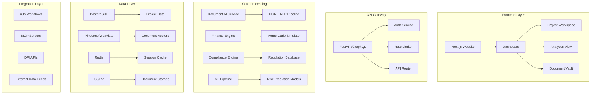

# SPARC Prompt for Infrastructure Finance Intelligence Platform (IFIP)

## PROJECT GENESIS COMMAND

Create a complete Infrastructure Finance Intelligence Platform (IFIP) that serves as the AI-powered bridge between Development Finance Institutions (DFIs) and energy transition projects. This platform will process complex project finance documents, generate compliance reports, and provide predictive analytics for infrastructure investments.

## 1. SPECIFICATION

### Core System Requirements

**Platform Name:** InfraFlow AI (working title)

**Mission:** Transform infrastructure project finance by reducing due diligence time by 50%, improving project success rates by 30%, and unlocking $1 trillion in energy transition financing.

**Target Users:**

* Primary: Investment Officers at DFIs (EBRD, EIB, BII, AfDB)
* Secondary: Project Sponsors, Government Agencies, EPCs
* Tertiary: Legal Advisors, Technical Consultants

### Functional Specifications

```yaml
Core_Capabilities:
  document_intelligence:
    - Multi-language ingestion (EN, FR, AR, ES, PT)
    - Extract key terms from 1000+ page documents
    - Auto-generate executive summaries
    - Risk factor identification
    - Regulatory compliance checking

  financial_modeling:
    - DCF analysis with 10,000 scenarios
    - Blended finance structuring
    - Currency risk modeling
    - Political risk quantification
    - Carbon credit valuation

  stakeholder_management:
    - 50+ stakeholder tracking per project
    - Automated status updates
    - Milestone monitoring
    - Issue escalation system

  compliance_engine:
    - EBRD Environmental Standards
    - IFC Performance Standards
    - EU Taxonomy alignment
    - Local content requirements
    - ESG scoring

Initial_Data_Sources:
  - Egypt Green Hydrogen (EGH) project documents
  - Public DFI project databases
  - World Bank infrastructure reports
  - Your existing client project data
  - Regulatory frameworks (per country)
```

## 2. PSEUDOCODE ARCHITECTURE

```python
# High-Level System Flow
class InfraFlowPlatform:
    def __init__(self):
        self.document_processor = DocumentAI()
        self.finance_engine = FinanceModeler()
        self.compliance_checker = ComplianceAI()
        self.prediction_model = RiskPredictor()
        self.report_generator = ReportBuilder()

    def process_new_project(self, project_docs):
        # Stage 1: Ingest & Understand
        extracted_data = self.document_processor.parse(project_docs)
        entities = self.identify_stakeholders(extracted_data)

        # Stage 2: Analyze & Model
        financial_model = self.finance_engine.build_model(extracted_data)
        risks = self.prediction_model.assess_risks(extracted_data, entities)
        compliance = self.compliance_checker.verify(extracted_data)

        # Stage 3: Generate Insights
        recommendations = self.generate_recommendations(
            financial_model, risks, compliance
        )

        # Stage 4: Create Deliverables
        outputs = {
            'investment_memo': self.report_generator.create_memo(),
            'risk_matrix': self.report_generator.create_risk_matrix(),
            'financial_model': financial_model.export_excel(),
            'compliance_report': compliance.generate_report()
        }

        return outputs
```

## 3. ARCHITECTURE DESIGN

### System Components



### Tech Stack

```yaml
Frontend:
  framework: Next.js 14 with App Router
  ui_library: Shadcn/ui + Tailwind CSS
  charts: Tremor.so for financial dashboards
  auth: Clerk or Auth.js
  hosting: Vercel

Backend:
  api: FastAPI (Python)
  document_processing: LangChain + Unstructured.io
  llm_orchestration: LangGraph
  financial_modeling: Python (numpy, pandas, scipy)
  hosting: Railway.app or Render

Database:
  primary: PostgreSQL (Supabase)
  vector: Pinecone or Weaviate
  cache: Redis (Upstash)
  files: Cloudflare R2 or AWS S3

AI/ML:
  llm: Claude 3.5 Sonnet via API
  embeddings: OpenAI Ada or Cohere
  ocr: Azure Document Intelligence
  training: Modal.com for custom models

Automation:
  workflows: n8n (self-hosted)
  mcp: Custom MCP servers for DFI integrations
  monitoring: Posthog analytics
```

## 4. IMPLEMENTATION ROADMAP

### Week 1-2: Foundation Sprint

```bash
# Setup commands for immediate start
npx create-next-app@latest infraflow-ai --typescript --tailwind --app
cd infraflow-ai

# Install core dependencies
npm install @supabase/supabase-js @langchain/core lucide-react
npm install @tremor/react @clerk/nextjs @uploadthing/react

# Setup backend
mkdir backend && cd backend
python -m venv venv && source venv/bin/activate
pip install fastapi langchain unstructured pandas numpy
pip install supabase pinecone-client python-multipart

# Initialize database
npx supabase init
```

### Core Database Schema

```sql
-- Projects table
CREATE TABLE projects (
    id UUID PRIMARY KEY DEFAULT uuid_generate_v4(),
    name TEXT NOT NULL,
    sponsor TEXT,
    country TEXT,
    sector TEXT,
    total_value DECIMAL(15,2),
    dfi_partners JSONB,
    status TEXT,
    risk_score FLOAT,
    created_at TIMESTAMP DEFAULT NOW(),
    updated_at TIMESTAMP DEFAULT NOW()
);

-- Documents table
CREATE TABLE documents (
    id UUID PRIMARY KEY DEFAULT uuid_generate_v4(),
    project_id UUID REFERENCES projects(id),
    name TEXT NOT NULL,
    type TEXT,
    url TEXT,
    processed BOOLEAN DEFAULT FALSE,
    extracted_data JSONB,
    embeddings_id TEXT,
    created_at TIMESTAMP DEFAULT NOW()
);

-- Financial models table
CREATE TABLE financial_models (
    id UUID PRIMARY KEY DEFAULT uuid_generate_v4(),
    project_id UUID REFERENCES projects(id),
    model_type TEXT,
    assumptions JSONB,
    outputs JSONB,
    scenarios JSONB,
    created_at TIMESTAMP DEFAULT NOW()
);

-- Compliance checks table
CREATE TABLE compliance_checks (
    id UUID PRIMARY KEY DEFAULT uuid_generate_v4(),
    project_id UUID REFERENCES projects(id),
    standard TEXT,
    status TEXT,
    issues JSONB,
    recommendations JSONB,
    checked_at TIMESTAMP DEFAULT NOW()
);
```

## 5. WEBSITE STRUCTURE

### Landing Page Copy

```markdown
# InfraFlow AI

## Accelerate Energy Transition Financing with AI

The intelligent platform connecting $130 trillion in climate finance
with bankable infrastructure projects.

### For Development Finance Institutions

- 50% faster due diligence
- Automated compliance checking
- Risk prediction powered by 1000+ projects
- One-click investment memos

### For Project Sponsors

- DFI-ready documentation
- Financial model optimization
- Multi-stakeholder coordination
- Regulatory navigation

[Start Free Pilot] [Book Demo] [View Case Studies]

### Trusted by Leading Institutions

[EBRD Logo] [EIB Logo] [AfDB Logo] [BII Logo]
```

### Dashboard Pages Structure

```typescript
// app/dashboard/page.tsx
interface DashboardPages {
  '/dashboard': 'Project portfolio overview',
  '/dashboard/projects': 'All projects list',
  '/dashboard/projects/[id]': 'Individual project workspace',
  '/dashboard/documents': 'Document processing center',
  '/dashboard/analytics': 'Portfolio analytics',
  '/dashboard/compliance': 'Compliance monitoring',
  '/dashboard/models': 'Financial model library',
  '/dashboard/reports': 'Generated reports',
  '/dashboard/settings': 'Platform settings'
}
```

## 6. DATA INGESTION PIPELINE

### Document Processing Workflow

```python
# backend/document_processor.py
from langchain.document_loaders import UnstructuredFileLoader
from langchain.text_splitter import RecursiveCharacterTextSplitter
from langchain.embeddings import OpenAIEmbeddings
from langchain.vectorstores import Pinecone
import asyncio

class DocumentProcessor:
    def __init__(self):
        self.loader = UnstructuredFileLoader()
        self.splitter = RecursiveCharacterTextSplitter(
            chunk_size=2000,
            chunk_overlap=200
        )
        self.embeddings = OpenAIEmbeddings()
        self.vector_store = Pinecone()

    async def process_document(self, file_path: str, project_id: str):
        # Stage 1: Load and parse
        raw_docs = self.loader.load(file_path)

        # Stage 2: Smart chunking
        chunks = self.splitter.split_documents(raw_docs)

        # Stage 3: Extract key information
        extracted = await self.extract_key_info(chunks)

        # Stage 4: Generate embeddings
        vectors = await self.embeddings.aembed_documents(
            [chunk.page_content for chunk in chunks]
        )

        # Stage 5: Store in vector database
        self.vector_store.add_documents(
            chunks,
            namespace=f"project_{project_id}"
        )

        # Stage 6: Update database
        await self.update_project_database(project_id, extracted)

        return extracted

    async def extract_key_info(self, chunks):
        # Use Claude to extract structured data
        prompt = """
        Extract the following from infrastructure project documents:
        - Project name and location
        - Total investment value
        - Key stakeholders
        - Technology specifications
        - Environmental impact metrics
        - Financial structure
        - Risk factors
        - Timeline and milestones

        Return as structured JSON.
        """
        # Process with Claude API
        return extracted_data
```

## 7. FIRST WEEK DELIVERABLES

### Day 1-2: Environment Setup

```bash
# Complete development environment
git init
npm create vite@latest frontend -- --template react-ts
python -m venv backend/venv
docker-compose up -d postgres redis
```

### Day 3-4: Core API

```python
# backend/main.py
from fastapi import FastAPI, UploadFile
from typing import List
import uvicorn

app = FastAPI(title="InfraFlow AI API")

@app.post("/api/projects/create")
async def create_project(name: str, country: str, sector: str):
    # Create new project
    pass

@app.post("/api/documents/upload")
async def upload_documents(project_id: str, files: List[UploadFile]):
    # Process uploaded documents
    pass

@app.get("/api/projects/{project_id}/analyze")
async def analyze_project(project_id: str):
    # Run full analysis pipeline
    pass
```

### Day 5-6: Basic UI

```tsx
// frontend/src/pages/Dashboard.tsx
export default function Dashboard() {
  return (
    <div className="p-8">
      <h1 className="text-3xl font-bold mb-8">
        Infrastructure Finance Intelligence Platform
      </h1>

      <div className="grid grid-cols-3 gap-6">
        <Card>
          <CardHeader>Active Projects</CardHeader>
          <CardContent>{/* Project list */}</CardContent>
        </Card>

        <Card>
          <CardHeader>Document Processing</CardHeader>
          <CardContent>{/* Upload interface */}</CardContent>
        </Card>

        <Card>
          <CardHeader>Risk Analytics</CardHeader>
          <CardContent>{/* Risk dashboard */}</CardContent>
        </Card>
      </div>
    </div>
  )
}
```

### Day 7: First Test Run

Feed your Egypt Green Hydrogen project documents through the system and generate your first automated investment memo.

## 8. IMMEDIATE NEXT STEPS

1. Right now: Save this entire prompt as SPARC_INFRAFLOW.md
2. Next hour: Set up GitHub repo and project structure
3. Today: Deploy basic landing page to Vercel
4. This week: Build document upload and processing pipeline
5. Next week: Create first DFI-compliant output template

## 9. SUCCESS METRICS

```yaml
Week 1:
  - Landing page live
  - Document upload working
  - Basic project creation

Week 2:
  - Process first real project
  - Generate compliance report
  - Basic financial model

Week 4:
  - 3 projects processed
  - First DFI user test
  - Risk prediction model v1

Week 8:
  - 10 projects in system
  - Pilot with one DFI
  - $100K in pipeline influenced
```

## LAUNCH COMMAND

```bash
# Start everything with one command
#!/bin/bash
echo "🚀 Launching InfraFlow AI Platform..."
cd frontend && npm run dev &
cd backend && uvicorn main:app --reload &
cd automation && n8n start &
echo "✅ Platform running at http://localhost:3000"
```
