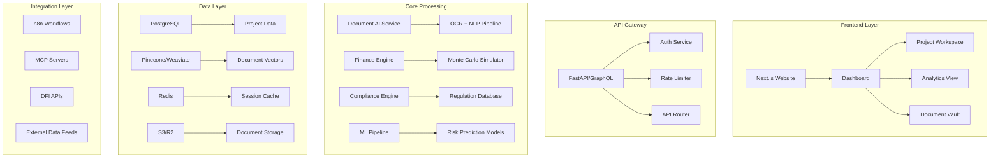

# InfraFlow AI - System Architecture Documentation

## Overview

InfraFlow AI is an Infrastructure Finance Intelligence Platform designed to accelerate energy transition financing by connecting Development Finance Institutions (DFIs) with bankable infrastructure projects through AI-powered analysis and automation.

## Table of Contents

1. [System Architecture](#system-architecture)
2. [Technology Stack](#technology-stack)
3. [Frontend Architecture](#frontend-architecture)
4. [Backend Architecture](#backend-architecture)
5. [Database Schema](#database-schema)
6. [API Design](#api-design)
7. [Data Flow](#data-flow)
8. [Security](#security)
9. [Deployment](#deployment)
10. [Development Setup](#development-setup)

---

## System Architecture

### High-Level Architecture

```
┌─────────────────────────────────────────────────────────────┐
│                     Frontend Layer                           │
│  Next.js 14 App Router + Shadcn/ui + Tailwind + Tremor      │
└─────────────────────────────────────────────────────────────┘
                            │
                            ↓
┌─────────────────────────────────────────────────────────────┐
│                     API Gateway Layer                        │
│       FastAPI + Rate Limiting + Authentication              │
└─────────────────────────────────────────────────────────────┘
                            │
                ┌───────────┴───────────┐
                ↓                       ↓
┌──────────────────────┐    ┌──────────────────────┐
│  Core Services       │    │   AI/ML Pipeline     │
│  - Projects          │    │   - Document AI      │
│  - Documents         │    │   - Finance Engine   │
│  - Compliance        │    │   - Risk Prediction  │
│  - Analytics         │    │   - Compliance AI    │
└──────────────────────┘    └──────────────────────┘
                │                       │
                └───────────┬───────────┘
                            ↓
┌─────────────────────────────────────────────────────────────┐
│                     Data Layer                               │
│  PostgreSQL + Vector DB + Redis + Object Storage            │
└─────────────────────────────────────────────────────────────┘
```

### Component Diagram



---

## Technology Stack

### Frontend

| Technology | Purpose | Version |
|------------|---------|---------|
| Next.js | React framework with App Router | 14.2.18 |
| TypeScript | Type safety | 5.x |
| Tailwind CSS | Styling framework | 3.4.1 |
| Shadcn/ui | Component library | Latest |
| Tremor.so | Financial dashboards | 3.18.3 |
| Clerk | Authentication | 5.7.5 |
| UploadThing | File uploads | 7.4.0 |
| Framer Motion | Animations | 11.12.0 |

### Backend

| Technology | Purpose | Version |
|------------|---------|---------|
| FastAPI | API framework | 0.109.0 |
| Python | Programming language | 3.11+ |
| Uvicorn | ASGI server | 0.27.0 |
| SQLAlchemy | ORM | 2.0.25 |
| Pydantic | Data validation | 2.5.3 |
| LangChain | LLM orchestration | 0.1.4 |
| Anthropic | Claude API | 0.8.1 |
| Unstructured | Document parsing | 0.12.0 |

### Database & Storage

| Technology | Purpose |
|------------|---------|
| PostgreSQL | Primary relational database |
| Supabase | Database hosting + Auth |
| Pinecone/Weaviate | Vector database for embeddings |
| Redis | Caching and sessions |
| Cloudflare R2 / AWS S3 | Document storage |

### AI/ML Services

| Service | Purpose |
|---------|---------|
| Claude 3.5 Sonnet | Primary LLM for analysis |
| OpenAI Embeddings | Document embeddings |
| Azure Form Recognizer | OCR and document extraction |
| Modal.com | Custom model training |

---

## Frontend Architecture

### Directory Structure

```
frontend/
├── src/
│   ├── app/                    # Next.js App Router
│   │   ├── (auth)/            # Auth-protected routes
│   │   │   ├── dashboard/     # Dashboard pages
│   │   │   ├── projects/      # Project management
│   │   │   └── analytics/     # Analytics pages
│   │   ├── layout.tsx         # Root layout
│   │   ├── page.tsx           # Landing page
│   │   └── globals.css        # Global styles
│   ├── components/            # React components
│   │   ├── ui/                # Shadcn UI components
│   │   ├── dashboard/         # Dashboard components
│   │   ├── projects/          # Project components
│   │   └── shared/            # Shared components
│   ├── lib/                   # Utilities
│   │   ├── utils.ts           # Helper functions
│   │   ├── supabase.ts        # Supabase client
│   │   └── api.ts             # API client
│   ├── hooks/                 # Custom React hooks
│   ├── types/                 # TypeScript types
│   └── utils/                 # Utility functions
├── public/                    # Static assets
├── package.json
├── tsconfig.json
├── next.config.js
└── tailwind.config.ts
```

### Key Features

1. **Server-Side Rendering (SSR)**: Improved SEO and initial load performance
2. **Client-Side Navigation**: Fast page transitions
3. **Type Safety**: Full TypeScript coverage
4. **Component Library**: Shadcn/ui for consistent UI
5. **Financial Charts**: Tremor.so for data visualization
6. **Authentication**: Clerk for user management

---

## Backend Architecture

### Directory Structure

```
backend/
├── app/
│   ├── api/                   # API routes
│   │   └── routes/
│   │       ├── projects.py
│   │       ├── documents.py
│   │       ├── financial_models.py
│   │       ├── compliance.py
│   │       └── analytics.py
│   ├── core/                  # Core functionality
│   │   ├── config.py          # Configuration
│   │   ├── security.py        # Authentication/Authorization
│   │   └── database.py        # Database connection
│   ├── models/                # SQLAlchemy models
│   │   └── database.py
│   ├── schemas/               # Pydantic schemas
│   │   ├── project.py
│   │   ├── document.py
│   │   └── ...
│   ├── services/              # Business logic
│   │   ├── document_processor.py
│   │   ├── finance_engine.py
│   │   ├── compliance_checker.py
│   │   └── risk_predictor.py
│   └── main.py                # FastAPI application
├── tests/                     # Test suite
├── requirements.txt
└── Dockerfile
```

### API Architecture Principles

1. **RESTful Design**: Clear resource-based endpoints
2. **Async/Await**: Non-blocking I/O operations
3. **Type Validation**: Pydantic schemas for all inputs/outputs
4. **Error Handling**: Consistent error responses
5. **Rate Limiting**: Protect against abuse
6. **Documentation**: Auto-generated OpenAPI/Swagger docs

---

## Database Schema

### Entity Relationship Diagram

```
┌─────────────┐
│   Users     │
└──────┬──────┘
       │
       │ 1:N
       ↓
┌─────────────┐       ┌──────────────┐
│  Projects   │──────→│  Documents   │
└──────┬──────┘  1:N  └──────────────┘
       │
       ├──────────────→ ┌────────────────────┐
       │           1:N  │ Financial Models   │
       │                └────────────────────┘
       │
       ├──────────────→ ┌────────────────────┐
       │           1:N  │ Compliance Checks  │
       │                └────────────────────┘
       │
       ├──────────────→ ┌─────────────────┐
       │           1:N  │  Stakeholders   │
       │                └─────────────────┘
       │
       └──────────────→ ┌──────────────────┐
                   1:N  │    Milestones    │
                        └──────────────────┘
```

### Core Tables

#### Projects
- Stores infrastructure project information
- Contains project metadata, status, and risk scores
- Central entity with relationships to all other tables

#### Documents
- Stores project documents with processing status
- Links to cloud storage (S3/R2) via URL
- Contains extracted data in JSONB format
- References vector embeddings for semantic search

#### Financial Models
- Stores financial analysis results
- Contains assumptions, outputs, and scenario data
- Multiple models per project (DCF, risk analysis, etc.)

#### Compliance Checks
- Tracks compliance against various standards
- Stores issues and recommendations
- Supports EBRD, IFC, EU Taxonomy, and other standards

For detailed schema, see: `/database/migrations/001_initial_schema.sql`

---

## API Design

### Base URL

```
Production: https://api.infraflow-ai.com/api/v1
Development: http://localhost:8000/api/v1
```

### Authentication

All API endpoints require authentication via Bearer token:

```http
Authorization: Bearer <jwt_token>
```

### Endpoints Overview

#### Projects API

```
POST   /api/v1/projects              Create new project
GET    /api/v1/projects              List projects (paginated)
GET    /api/v1/projects/{id}         Get project details
PUT    /api/v1/projects/{id}         Update project
DELETE /api/v1/projects/{id}         Delete project
POST   /api/v1/projects/{id}/analyze Run AI analysis
```

#### Documents API

```
POST   /api/v1/documents/{project_id}/upload  Upload documents
GET    /api/v1/documents/{id}                 Get document
POST   /api/v1/documents/{id}/process         Process document
```

#### Financial Models API

```
POST   /api/v1/financial-models/{project_id}/create  Create model
GET    /api/v1/financial-models/{id}                 Get model
POST   /api/v1/financial-models/{id}/run-scenarios   Run scenarios
```

#### Compliance API

```
POST   /api/v1/compliance/{project_id}/check  Check compliance
GET    /api/v1/compliance/{id}                Get check results
```

#### Analytics API

```
GET    /api/v1/analytics/dashboard            Dashboard metrics
GET    /api/v1/analytics/portfolio            Portfolio analytics
GET    /api/v1/analytics/projects/{id}/risk-assessment  Risk assessment
```

### Response Format

All API responses follow this structure:

```json
{
  "data": {},
  "meta": {},
  "errors": []
}
```

---

## Data Flow

### Document Processing Pipeline

```
1. Upload Document
   ↓
2. Store in R2/S3
   ↓
3. Queue Processing Job (Celery)
   ↓
4. Extract Text (Unstructured.io)
   ↓
5. Generate Embeddings (OpenAI)
   ↓
6. Store in Vector DB (Pinecone)
   ↓
7. Extract Key Information (Claude)
   ↓
8. Update Database
   ↓
9. Notify User (WebSocket/SSE)
```

### Project Analysis Pipeline

```
1. Trigger Analysis
   ↓
2. Gather Project Data
   ↓
3. Run Parallel Analysis:
   - Financial Modeling
   - Risk Assessment
   - Compliance Check
   - Stakeholder Analysis
   ↓
4. Aggregate Results
   ↓
5. Generate Reports
   ↓
6. Store Results
   ↓
7. Return to User
```

---

## Security

### Authentication & Authorization

- **User Authentication**: Clerk/Auth.js with JWT tokens
- **API Authentication**: Bearer token validation
- **Role-Based Access Control (RBAC)**: Admin, DFI Officer, Sponsor, Consultant, User

### Data Security

- **Encryption at Rest**: PostgreSQL with encryption, encrypted S3 buckets
- **Encryption in Transit**: TLS 1.3 for all connections
- **Data Isolation**: Row-level security in PostgreSQL
- **Audit Logging**: All actions logged in activity_log table

### API Security

- **Rate Limiting**: 60 requests/minute, 1000 requests/hour
- **CORS**: Restricted to allowed origins
- **Input Validation**: Pydantic schemas for all inputs
- **SQL Injection Prevention**: Parameterized queries via SQLAlchemy

---

## Deployment

### Frontend Deployment (Vercel)

```bash
# Automatic deployment on push to main
git push origin main
```

**Environment Variables:**
- `NEXT_PUBLIC_API_URL`
- `NEXT_PUBLIC_SUPABASE_URL`
- `NEXT_PUBLIC_SUPABASE_ANON_KEY`
- `NEXT_PUBLIC_CLERK_PUBLISHABLE_KEY`

### Backend Deployment (Railway/Render)

```bash
# Deploy via Railway CLI
railway up
```

**Environment Variables:**
- `DATABASE_URL`
- `REDIS_URL`
- `ANTHROPIC_API_KEY`
- `OPENAI_API_KEY`
- `AWS_ACCESS_KEY_ID`
- `AWS_SECRET_ACCESS_KEY`
- `SECRET_KEY`
- `SENTRY_DSN`

### Database Deployment (Supabase)

```bash
# Run migrations
npx supabase db push
```

---

## Development Setup

### Prerequisites

- Node.js 18+
- Python 3.11+
- PostgreSQL 15+
- Redis 7+

### Frontend Setup

```bash
cd frontend
npm install
cp .env.example .env.local
npm run dev
```

### Backend Setup

```bash
cd backend
python -m venv venv
source venv/bin/activate  # On Windows: venv\Scripts\activate
pip install -r requirements.txt
cp .env.example .env
uvicorn app.main:app --reload
```

### Database Setup

```bash
# Using Supabase
npx supabase init
npx supabase start
npx supabase db reset

# Or using local PostgreSQL
createdb infraflow_ai
psql infraflow_ai < database/migrations/001_initial_schema.sql
```

---

## Performance Optimization

### Frontend

- **Code Splitting**: Automatic via Next.js
- **Image Optimization**: Next.js Image component
- **Static Generation**: Pre-render pages where possible
- **Client-Side Caching**: React Query for API responses

### Backend

- **Database Indexing**: All foreign keys and frequently queried columns
- **Query Optimization**: Eager loading with SQLAlchemy
- **Caching**: Redis for expensive queries
- **Async Operations**: FastAPI async endpoints
- **Background Jobs**: Celery for long-running tasks

### Database

- **Connection Pooling**: PgBouncer
- **Read Replicas**: For analytics queries
- **Partitioning**: Large tables partitioned by date
- **Vacuum**: Automated maintenance

---

## Monitoring & Observability

### Application Monitoring

- **Sentry**: Error tracking and performance monitoring
- **PostHog**: Product analytics
- **Uptime Robot**: Availability monitoring

### Infrastructure Monitoring

- **Railway/Render**: Built-in metrics
- **Supabase**: Database metrics
- **Cloudflare**: CDN and security metrics

### Logging

- **Structured Logging**: JSON format with python-json-logger
- **Log Aggregation**: Sentry or similar
- **Log Levels**: DEBUG, INFO, WARNING, ERROR, CRITICAL

---

## Future Enhancements

1. **GraphQL API**: For more flexible data queries
2. **WebSocket Support**: Real-time updates
3. **Multi-tenancy**: Organization-level isolation
4. **Mobile App**: React Native or Flutter
5. **Offline Support**: Progressive Web App (PWA)
6. **Advanced ML Models**: Custom risk prediction models
7. **Integration Hub**: Connectors for major DFI systems
8. **Automated Testing**: E2E tests with Playwright

---

## Contact & Support

- **Documentation**: https://docs.infraflow-ai.com
- **API Reference**: https://api.infraflow-ai.com/docs
- **GitHub**: https://github.com/infraflow-ai/platform
- **Support**: support@infraflow-ai.com

---

**Last Updated**: 2024-11-23
**Version**: 0.1.0
**Maintained By**: InfraFlow AI Engineering Team
